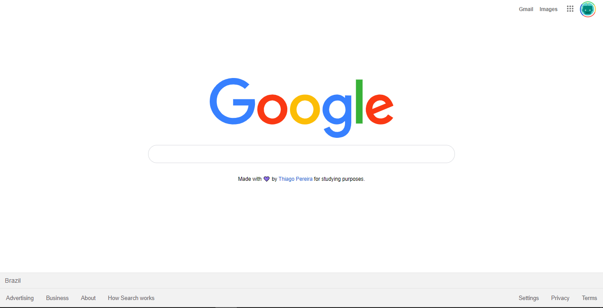

<h1 align="center">
    
Clone da página inicial do Google

</h1>

# :clipboard: Índice

- [Sobre](#sobre)
- [Preview](#preview)
- [Tecnologias Utilizadas](#tecnologias-utilizadas)
- [License](#license)

---

<a id="sobre">

# :computer: Sobre

Um clone da UI da página principal do Google, construido em HTML e CSS. Página responsiva para todos os dispositivos.

---

<a id="preview">

# :tv: Preview

    

---

<a id="tecnologias-utilizadas">

# :cd: Tecnologias utilizadas

A UI utiliza as tecnologias:

- HTML
- CSS 

---

## :recycle: Como contribuir

- Faça um Fork desse projeto
- Crie uma branch
- Commit suas mudanças
- Push a sua Branch
- Crie um Pull Request

---

<a id="license"><a>

## :memo: License

Esse projeto está sob a licença MIT. Veja o arquivo [LICENSE](LICENSE) para mais detalhes.

---

    Desenvolvido com 💜 por Thiago Pereira

